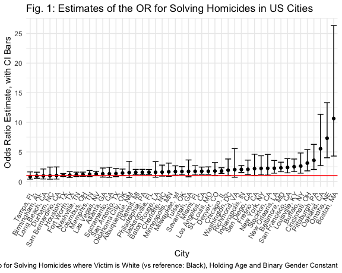

Homework 6, Linear Models
================
Emil Hafeez (eh2928)
11/23/2020

# Problem One

Read in and tidy

``` r
homicide_df = 
  read_csv("data/homicide.csv", na = c("", "NA", "Unknown")) %>% 
  mutate(
    city_state = str_c(city, state, sep = ", "),
    victim_age = as.numeric(victim_age),
    resolution = case_when(
      disposition == "Closed without arrest" ~ 0,
      disposition == "Open/No arrest"        ~ 0,
      disposition == "Closed by arrest"      ~ 1)
  ) %>% 
  filter(
    victim_race %in% c("White", "Black"),
    !city_state %in% c("Tulsa, AL", "Dallas, TX", "Phoenix, AZ", "Kansas City, MO")) %>% 
  select(city_state, resolution, victim_age, victim_race, victim_sex)
```

Start with a regression for just one city.

``` r
baltimore_df =
  homicide_df %>% 
  filter(city_state == "Baltimore, MD")

glm(resolution ~ victim_age + victim_race + victim_sex, 
    data = baltimore_df,
    family = binomial()) %>% 
  broom::tidy() %>% 
  mutate(
    OR = exp(estimate),
    CI_lower = exp(estimate - 1.96 * std.error),
    CI_upper = exp(estimate + 1.96 * std.error)
  ) %>% 
  select(term, OR, starts_with("CI")) %>% 
  knitr::kable(col.names =
                c("Variable", "Odds Ratio Estimate", "Lower CI", "Upper CI"),
              align = "cccc", 
              digits = 3
              )
```

|     Variable      | Odds Ratio Estimate | Lower CI | Upper CI |
| :---------------: | :-----------------: | :------: | :------: |
|    (Intercept)    |        1.363        |  0.975   |  1.907   |
|    victim\_age    |        0.993        |  0.987   |  1.000   |
| victim\_raceWhite |        2.320        |  1.648   |  3.268   |
|  victim\_sexMale  |        0.426        |  0.325   |  0.558   |

Now, let’s run this across multiple cities (all of the 47 remaining).

``` r
models_results_df = 
  homicide_df %>% 
  nest(data = -city_state) %>% 
  mutate(
    models = 
      map(.x = data, ~glm(resolution ~ victim_age + victim_race + victim_sex, data = .x, family = binomial())),
    results = map(models, broom::tidy)
  ) %>% 
  select(city_state, results) %>% 
  unnest(results) %>% 
  mutate(
    OR = exp(estimate),
    CI_lower = exp(estimate - 1.96 * std.error),
    CI_upper = exp(estimate + 1.96 * std.error)
  ) %>% 
  select(city_state, term, OR, starts_with("CI")) 
```

Plot the resultant ORs and CIs of the logistic regression.

``` r
models_results_df %>% 
  filter(term == "victim_raceWhite") %>% 
  mutate(city_state = fct_reorder(city_state, OR)) %>% 
  ggplot(aes(x = city_state, y = OR)) + 
  geom_point() + 
  geom_errorbar(aes(ymin = CI_lower, ymax = CI_upper)) + 
  geom_hline(yintercept = 1, color = "red") +
  theme(axis.text.x = element_text(angle = 60, vjust = 1, hjust = 1)) +
  scale_y_continuous(breaks = seq(0, 30, 5)) +
  labs(
    title = "Fig. 1: Estimates of the OR for Solving Homicides in US Cities",
    x = "City",
    y = "Odds Ratio Estimate, with CI Bars",
    caption = "Homework 6: Odds Ratio for Solving Homicides where Victim is White (vs reference: Black), Holding Age and Binary Gender Constant")
```



The results show that in many US cities of the 47 for which data are
available, the odds of a homicide case ending in arrest are greater when
the victim is white compared to Black, holding age of the victim and
gender (binary) constant. While there is variability in these estimated
which often overlaps the null hypothesis value of OR = 1, most estimates
are above 1, and many cities have CIs above 1 which do not overlap the
null. This is another modern example of racial injustice in our judicial
system, for even if arrest and incarceration is not an effective
solution, the apparent racial disparity of whose victims find “justice”
as defined by our criminal system feels like yet another example of who
is prioritized in our society.

# Problem Two

``` r
birthweight_df = 
  read_csv("data/birthweight.csv") %>% 
  mutate(
    babysex = as.factor(babysex),
    frace = as.factor(frace),
    mrace = as.factor(mrace)
  ) %>% 
  ungroup() %>% 
  select(bwt, babysex, bhead, blength, gaweeks, malform, ppbmi, ppwt, delwt, wtgain, mheight, momage, mrace, menarche, frace, fincome, parity, pnumlbw, pnumsga, smoken)
```

    ## Parsed with column specification:
    ## cols(
    ##   .default = col_double()
    ## )

    ## See spec(...) for full column specifications.

``` r
summary(birthweight_df)
```

Let’s get model comparison working with the two given models

# Problem Three
